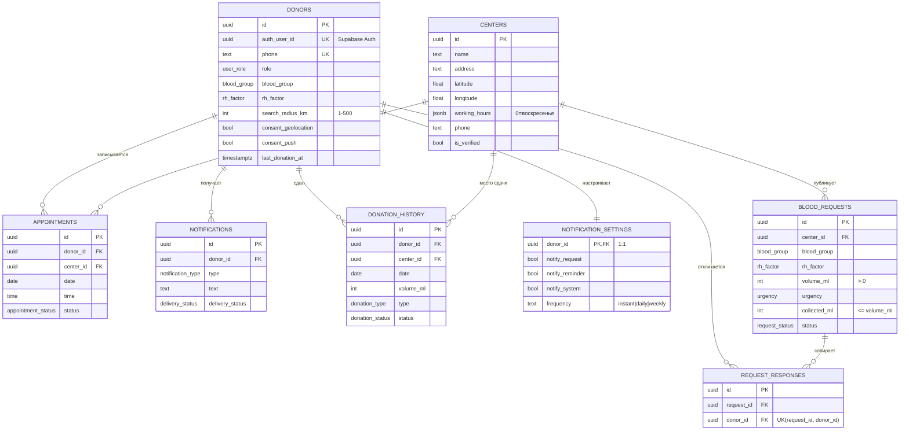

# Схема базы данных «Капля»

Документ описывает структуру базы данных PostgreSQL: сущности, связи, ограничения и индексы. Схема разворачивается в управляемом PostgreSQL (Supabase) через SQL-миграции из каталога `supabase/migrations`.

## 1. Обзор

База данных обслуживает три роли системы (раздел 3 ТЗ): **гость** (только чтение), **донор** (профиль, запись, отклики, история) и **координатор центра** (публикация и ведение заявок).

Сущности и связи соответствуют модели данных MVP (раздел 7 ТЗ) и TypeScript-моделям в `src/types/index.ts`.

### ER-диаграмма



## 2. Сущности и таблицы

| Таблица | Сущность | TS-модель | Назначение |
|---|---|---|---|
| `donors` | Донор | `Donor` | Профиль донора/координатора, согласия, радиус |
| `centers` | Центр крови | `Center` | Справочник центров для карты и записи |
| `blood_requests` | Заявка (потребность) | `BloodRequest` | Живая лента потребностей |
| `appointments` | Запись на донацию | `Appointment` | Слоты записи, статусы подтверждения |
| `request_responses` | Отклик | `RequestResponse` | Отметки «иду сдавать» на заявку |
| `notifications` | Уведомление | `Notification` | Push-уведомления и статус доставки |
| `donation_history` | История донаций | `DonationHistoryEntry` | Журнал сдач (FR-6) |
| `notification_settings` | Настройки | — (1:1 с донором) | Типы и частота уведомлений |

## 3. Соответствие фронтенд-моделям (camelCase → snake_case)

Схема хранит данные в snake_case; преобразование имён выполняет клиент (Supabase JS / уровень API).

| TS-модель | Поле TS | Колонка SQL | Примечание |
|---|---|---|---|
| `Donor` | `consents.geolocation` / `consents.push` | `consent_geolocation` / `consent_push` | Вложенный объект развёрнут в два поля |
| `Center` | `coordinates: [lat, lng]` | `latitude`, `longitude` | Массив разделён на два числовых поля (индексируемость, CHECK-границы) |
| `BloodRequest` | `createdAt` / `updatedAt` | `created_at` / `updated_at` | `updated_at` поддерживается триггером |
| `DonationHistoryEntry` | `centerName` | — | Вычисляется `join` с `centers`, не хранится |
| `Donor` | `lastDonationAt` | `last_donation_at` | Используется для контроля интервала ≥ 60 дней (FR-5) |

## 4. Перечисления

Все «магические строки» фронтенда вынесены в типы PostgreSQL `ENUM` — значения совпадают с union-типами TypeScript:

| Тип | Значения |
|---|---|
| `blood_group` | `1`, `2`, `3`, `4` |
| `rh_factor` | `+`, `-` |
| `urgency` | `обычная`, `срочная`, `критичная` |
| `request_status` | `active`, `closed` |
| `appointment_status` | `pending`, `confirmed`, `cancelled`, `missed` |
| `notification_type` | `request`, `reminder`, `system` |
| `delivery_status` | `sent`, `delivered`, `failed` |
| `donation_type` | `цельная кровь`, `плазма`, `тромбоциты`, `эритроциты` |
| `donation_status` | `завершена`, `отменена`, `не состоялась` |
| `user_role` | `donor`, `coordinator` |

## 5. Ограничения целостности

- `donors.search_radius_km BETWEEN 1 AND 500` — требование FR-1.1;
- `blood_requests.collected_ml <= volume_ml` — прогресс сбора не превышает объём;
- `blood_requests.volume_ml > 0`, `donation_history.volume_ml > 0`;
- `donors.phone UNIQUE` — один профиль на номер телефона;
- `request_responses (request_id, donor_id) UNIQUE` — один отклик на заявку от донора;
- `donors.latitude/longitude` — CHECK-границы координат (±90 / ±180);
- `notification_settings.frequency IN ('instant','daily','weekly')`;
- `ON DELETE CASCADE` для дочерних записей донора и заявок центра; история донаций сохраняет `center_id` без каскада (журнал не должен удаляться вместе с центром).

## 6. Индексы

| Индекс | Таблица | Назначение |
|---|---|---|
| `idx_blood_requests_feed (status, urgency, created_at DESC)` | `blood_requests` | Живая лента: активные заявки по срочности и свежести (FR-3) |
| `idx_blood_requests_center` | `blood_requests` | Заявки конкретного центра |
| `idx_appointments_donor` | `appointments` | Записи донора, контроль интервала |
| `idx_appointments_center_date` | `appointments` | Занятость слотов центра на дату |
| `idx_request_responses_request` / `_donor` | `request_responses` | Отклики заявки / донора (FR-8) |
| `idx_notifications_donor (donor_id, created_at DESC)` | `notifications` | Лента уведомлений |
| `idx_donation_history_donor (donor_id, date DESC)` | `donation_history` | История донаций (FR-6) |

## 7. Связь с аутентификацией

Колонка `donors.auth_user_id` (UNIQUE, FK на `auth.users`) связывает профиль с учётной записью Supabase Auth (вход по телефону с одноразовым кодом, раздел 10 ТЗ). Это позволяет политикам Row Level Security (Шаг «Безопасность») определять владельца строки через `auth.uid()`.

## 8. Триггеры

Функция `set_updated_at()` автоматически обновляет `updated_at` при `UPDATE` в таблицах `donors`, `centers`, `blood_requests`, `appointments`.

## 9. Развёртывание

Миграция применяется в SQL Editor Supabase либо через CLI:

```bash
supabase db push   # применяет все миграции из supabase/migrations
```

Порядок файлов соответствует лексикографической сортировке имён (`0001_...`, `0002_...`, ...).

